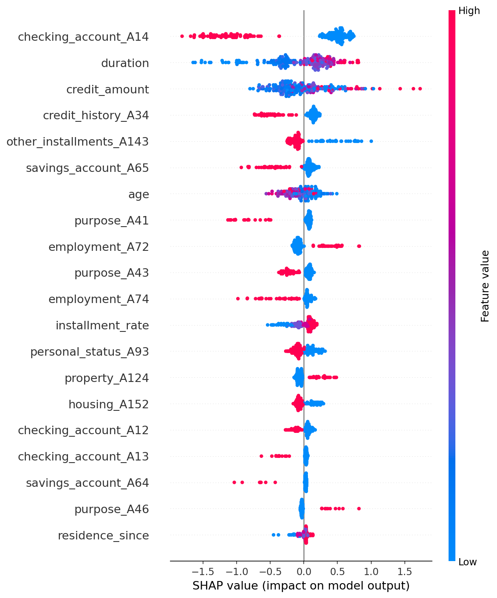

# credit-risk-scorer

XGBoost credit risk classifier with SHAP explainability on the UCI German Credit dataset.
Predicts whether a loan applicant is a good or bad credit risk and explains why.

## Results

| Metric | Score |
|---|---|
| Accuracy | see output |
| ROC-AUC | see output |

## SHAP Summary Plot



Each row is a feature. Red = high value, Blue = low value.
Features pushed right increase bad credit risk. Features pushed left decrease it.

## Dataset

UCI German Credit Data 1,000 applicants, 20 features.

## Stack

`XGBoost` · `SHAP` · `scikit-learn` · `pandas` · `matplotlib` · `pytest` · `GitHub Actions`

## Quickstart

```bash
git clone https://github.com/Mahad-tech/credit-risk-scorer.git
cd credit-risk-scorer
python -m venv venv && source venv/bin/activate
pip install -r requirements.txt

python src/data/preprocess.py    # clean and encode data
python src/models/train.py       # train XGBoost model
python src/models/explain.py     # generate SHAP plots
pytest tests/ -v                 # run tests
```

## Key Design Decisions

- `stratify=y` in train/test split preserves the 70/30 class imbalance
- SHAP TreeExplainer chosen for XGBoost exact values, not approximations
- Waterfall plot explains a single prediction shows exactly why one applicant was flagged
- No FastAPI explainability is the differentiator here
